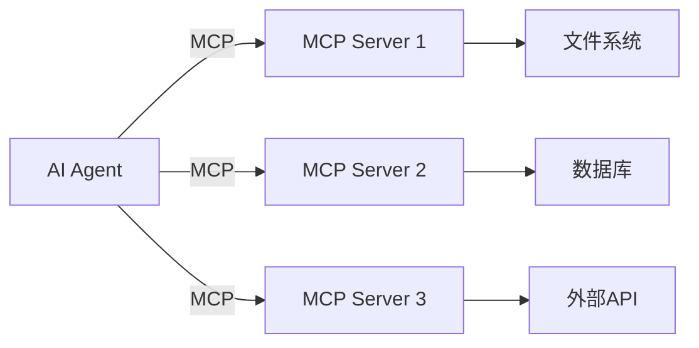

# 噼哩噼哩 Pilipili-AutoVideo 生态与插件系统设计

## 文档信息

- **文档编号**: DEV-DOC-009
- **版本**: 1.0
- **创建日期**: 2026-03-26
- **项目**: Pilipili-AutoVideo
- **类型**: 生态与插件系统设计文档

---

## 1. 为什么生态和插件很重要

### 1.1 美国科技公司的启示

看看美国领先的 AI 公司如何构建生态：

| 公司 | 插件/生态产品 | 生态策略 |
|------|---------------|----------|
| **OpenAI** | GPTs、Plugin Store | 用户创建自定义 GPT，插件市场 |
| **Anthropic** | Claude Code Skills | 技能市场，开发者扩展 |
| **Microsoft** | Semantic Kernel Plugins、Copilot Extensions | 企业级插件框架，MCP 协议推动者 |
| **GitHub** | Copilot Extensions | 开发者工具扩展生态 |
| **Stripe** | API-first生态 | 开发者生态的典范 |

**核心洞察**：
- 单个产品的价值有限，**生态系统的价值**才是护城河
- **插件机制**让第三方开发者参与创新
- **开放标准**（如 MCP）让整个生态互联互通

### 1.2 中国软件的差距

| 维度 | 美国公司 | 中国公司 |
|------|----------|----------|
| **开放接口** | 几乎所有产品都有 Plugin/API | 封闭系统为主 |
| **开发者生态** | 活跃的插件市场 | 很少有插件生态 |
| **标准协议** | MCP、OpenAPI 广泛采用 | 各自为政 |
| **变现模式** | 插件分成、平台费 | 卖软件许可证 |

**中国软件需要学习**：
1. **开放心态**：从"所有功能自己做"到"让生态来做"
2. **标准先行**：采用/推动行业标准
3. **开发者第一**：把开发者当用户来服务

---

## 2. Pilipili-AutoVideo 生态设计

### 2.1 三层生态架构

```
┌─────────────────────────────────────────────────────────────────┐
│                      第三方插件层                              │
│   ┌─────────┐ ┌─────────┐ ┌─────────┐ ┌─────────┐ ┌─────────┐ │
│   │模板插件 │ │渲染引擎 │ │数据源   │ │特效插件 │ │输出格式 │ │
│   └─────────┘ └─────────┘ └─────────┘ └─────────┘ └─────────┘ │
├─────────────────────────────────────────────────────────────────┤
│                      技能(Skill)层                            │
│   ┌─────────────────────────────────────────────────────┐   │
│   │ VideoGen Skill │ Analysis Skill │ Edit Skill │ ...  │   │
│   └─────────────────────────────────────────────────────┘   │
├─────────────────────────────────────────────────────────────────┤
│                      核心能力层                                │
│   ┌────────┬────────┬────────┬────────┬────────┬────────┐     │
│   │ LLM   │ImageGen│  TTS   │VideoGen│Assembler│Memory │     │
│   └────────┴────────┴────────┴────────┴────────┴────────┘     │
└─────────────────────────────────────────────────────────────────┘
```

### 2.2 插件类型定义

| 类型 | 说明 | 示例 |
|------|------|------|
| **模板插件** | 预定义视频模板 | "科普视频模板"、"种草视频模板" |
| **渲染引擎** | 替代默认 FFmpeg 渲染 | 使用 Davinci Resolve API |
| **数据源插件** | 接入外部数据 | 天气 API、股票数据、新闻摘要 |
| **特效插件** | 视频特效扩展 | 动态贴纸、AR 滤镜、转场特效 |
| **输出格式** | 导出格式扩展 | 导出到 YouTube、抖音、B站 |
| **分析插件** | 视频分析扩展 | 版权检测、内容审核、情感分析 |

---

## 3. 技能(Skill)系统设计

### 3.1 什么是 Skill

Skill（技能）是 Pilipili-AutoVideo 的**原子化能力单元**，它：
- 封装一个完整的工作流
- 可被 AI Agent 调用
- 有标准的输入/输出接口
- 支持动态发现和组合

### 3.2 Skill Manifest 格式

参考 Claude Code Skills 和 MCP 规范，设计 Pilipili 的 Skill 格式：

```yaml
# skills/video-generator/SKILL.md
---
name: video-generator
display_name: 视频生成器
description: |
  将自然语言主题转化为完整的短视频，包含配音、字幕和转场。
  支持多种视频风格和时长。
version: 1.0.0
author: Pilipili Team
tags:
  - video
  - ai
  - generation

activation:
  type: on-demand  # on-startup | on-demand | context-match
  patterns:
    - "生成视频"
    - "制作短视频"
    - "create video"

capabilities:
  inputs:
    - name: topic
      type: string
      required: true
      description: 视频主题描述
    - name: duration
      type: integer
      required: false
      default: 60
      description: 目标时长（秒）
    - name: style
      type: string
      required: false
      description: 视频风格描述
  
  outputs:
    - name: video_path
      type: string
      description: 生成的视频文件路径
    - name: draft_path
      type: string
      description: 剪映草稿目录

execution:
  type: workflow
  steps:
    - generate_script
    - generate_keyframes
    - generate_audio
    - generate_video
    - assemble

config:
  llm_provider: deepseek
  video_engine: auto
  max_retries: 3
---

# 使用说明

## 触发方式

在 AI Agent 对话中使用以下指令激活：

```
请帮我生成一个关于"AI改变世界"的视频，时长60秒，科技风格。
```

## 输出

- MP4 视频文件
- 剪映草稿（可选）
- SRT 字幕文件

## 配置选项

| 选项 | 默认值 | 说明 |
|------|--------|------|
| engine | auto | kling/seedance/auto |
| add_subtitles | true | 是否添加字幕 |
| resolution | 1080p | 720p/1080p/4K |
```

### 3.3 Skill 注册与发现

```python
# modules/skills/registry.py

class SkillRegistry:
    """Skill 注册表 - 支持文件系统注册和远程注册"""
    
    def __init__(self, skills_dir: str = "./skills"):
        self.skills_dir = Path(skills_dir)
        self._skills: dict[str, Skill] = {}
    
    def discover(self):
        """自动发现所有 Skill"""
        for skill_dir in self.skills_dir.iterdir():
            if skill_dir.is_dir() and (skill_dir / "SKILL.md").exists():
                skill = self._load_skill(skill_dir)
                self._skills[skill.name] = skill
    
    def get(self, name: str) -> Optional[Skill]:
        """获取指定 Skill"""
        return self._skills.get(name)
    
    def search(self, query: str) -> list[Skill]:
        """搜索 Skill"""
        results = []
        for skill in self._skills.values():
            if query in skill.name or query in skill.description:
                results.append(skill)
        return results
    
    def execute(self, name: str, inputs: dict) -> dict:
        """执行 Skill"""
        skill = self.get(name)
        if not skill:
            raise ValueError(f"Skill not found: {name}")
        
        # 执行工作流
        return skill.execute(inputs)
```

### 3.4 内置 Skill 示例

```yaml
# skills/script-generator/SKILL.md
---
name: script-generator
display_name: 脚本生成器
description: 仅生成视频脚本，不调用付费 API
version: 1.0.0
tags:
  - script
  - llm

capabilities:
  inputs:
    - name: topic
      type: string
      required: true
    - name: style
      type: string
      required: false
    - name: duration
      type: integer
      default: 60

  outputs:
    - name: script_json
      type: string
      description: JSON 格式的脚本
---

# skills/analysis-skill/SKILL.md
---
name: analysis-skill
display_name: 视频分析器
description: 分析对标视频，提取分镜结构和人物信息
version: 1.0.0
tags:
  - analysis
  - video

capabilities:
  inputs:
    - name: video_path
      type: string
      required: true

  outputs:
    - name: analysis_result
      type: object
---

# skills/jianying-export/SKILL.md
---
name: jianying-export
display_name: 剪映导出
description: 将视频导出为剪映草稿格式
version: 1.0.0
tags:
  - export
  - jianying
---

# skills/web-search-skill/SKILL.md  
---
name: web-search-skill
display_name: 网络搜索
description: 搜索网络获取最新信息，用于视频内容创作
version: 1.0.0
tags:
  - search
  - web
capabilities:
  inputs:
    - name: query
      type: string
      required: true
  outputs:
    - name: results
      type: array
---
```

---

## 4. 插件(Plugin)系统设计

### 4.1 插件架构

```python
# modules/plugins/base.py

from abc import ABC, abstractmethod
from typing import Any, Dict, Optional
from dataclasses import dataclass

@dataclass
class PluginManifest:
    """插件清单"""
    name: str
    version: str
    display_name: str
    description: str
    author: str
    tags: list[str]
    dependencies: list[str]  # 依赖的其他插件
    config_schema: Dict[str, Any]  # 配置项定义

class Plugin(ABC):
    """插件基类"""
    
    def __init__(self, manifest: PluginManifest, config: Dict[str, Any]):
        self.manifest = manifest
        self.config = config
        self.enabled = True
    
    @abstractmethod
    def initialize(self):
        """初始化插件"""
        pass
    
    @abstractmethod
    def execute(self, context: Dict[str, Any]) -> Dict[str, Any]:
        """执行插件逻辑"""
        pass
    
    def shutdown(self):
        """关闭插件"""
        pass


class PluginManager:
    """插件管理器"""
    
    def __init__(self):
        self._plugins: Dict[str, Plugin] = {}
    
    def register(self, plugin: Plugin):
        """注册插件"""
        self._plugins[plugin.manifest.name] = plugin
    
    def execute_pipeline(self, stage: str, context: Dict[str, Any]) -> Dict[str, Any]:
        """执行插件管道"""
        for plugin in self._plugins.values():
            if not plugin.enabled:
                continue
            
            # 检查插件是否处理这个阶段
            if hasattr(plugin, 'stages') and stage in plugin.stages:
                context = plugin.execute(context)
        
        return context
```

### 4.2 插件类型实现

```python
# plugins/template_plugin.py

class TemplatePlugin(Plugin):
    """模板插件 - 预定义视频模板"""
    
    def __init__(self, manifest, config, template_path):
        super().__init__(manifest, config)
        self.template_path = template_path
        self.template_data = self._load_template()
    
    def execute(self, context):
        # 应用模板
        script = context.get("script")
        
        # 替换模板占位符
        for placeholder, value in self.template_data.items():
            script = script.replace(f"{{{placeholder}}}", value)
        
        context["script"] = script
        return context


# plugins/renderer_plugin.py

class RendererPlugin(Plugin):
    """渲染引擎插件 - 替换默认 FFmpeg"""
    
    def __init__(self, manifest, config, renderer_type):
        super().__init__(manifest, config)
        self.renderer_type = renderer_type
    
    def execute(self, context):
        clips = context.get("clips")
        
        if self.renderer_type == "davinci":
            # 使用 DaVinci Resolve API
            context["output"] = self._render_davinci(clips)
        elif self.renderer_type == "local":
            # 本地 FFmpeg
            context["output"] = self._render_ffmpeg(clips)
        
        return context


# plugins/data_source_plugin.py

class DataSourcePlugin(Plugin):
    """数据源插件 - 接入外部数据"""
    
    def __init__(self, manifest, config, api_config):
        super().__init__(manifest, config)
        self.api_config = api_config
    
    def execute(self, context):
        topic = context.get("topic")
        
        # 根据数据类型获取数据
        if self.config.get("data_type") == "weather":
            data = self._fetch_weather(topic)
        elif self.config.get("data_type") == "stock":
            data = self._fetch_stock(topic)
        
        # 将数据注入到脚本上下文
        context["external_data"] = data
        return context
```

### 4.3 插件市场

```json
{
  "schema_version": "v1",
  "marketplace": {
    "version": "1.0.0",
    "updated_at": "2026-03-26T00:00:00Z",
    "plugins": [
      {
        "name": "tech-explainer-template",
        "display_name": "科技解说模板",
        "description": "适合科技类视频的解说模板，包含开场白、转折语、结尾",
        "version": "1.0.0",
        "author": "Pilipili Team",
        "tags": ["template", "tech"],
        "installs": 1250,
        "rating": 4.8,
        "price": "free"
      },
      {
        "name": "davinci-renderer",
        "display_name": "DaVinci Resolve 渲染",
        "description": "使用 DaVinci Resolve 进行专业级调色和渲染",
        "version": "1.0.0",
        "author": "Community",
        "tags": ["renderer", "pro"],
        "installs": 320,
        "rating": 4.5,
        "price": "free"
      },
      {
        "name": "weather-data-source",
        "display_name": "天气数据源",
        "description": "自动获取当地天气信息用于视频内容",
        "version": "1.0.0",
        "author": "Community",
        "tags": ["data", "weather"],
        "installs": 890,
        "rating": 4.2,
        "price": "free"
      }
    ]
  }
}
```

---

## 5. MCP 协议集成

### 5.1 什么是 MCP

MCP（Model Context Protocol）是 Anthropic 推动的**AI Agent 插件标准**，目标是让所有 AI 工具可以互操作。



### 5.2 集成 MCP 到 Pilipili

```python
# modules/mcp/server.py

from mcp.server import Server
from mcp.types import Tool, Resource
import asyncio

class PilipiliMCPServer:
    """Pilipili MCP 服务器"""
    
    def __init__(self):
        self.server = Server("pilipili-auto")
        
        @self.server.list_tools()
        async def list_tools():
            return [
                Tool(
                    name="generate_video",
                    description="生成短视频",
                    inputSchema={
                        "type": "object",
                        "properties": {
                            "topic": {"type": "string", "description": "视频主题"},
                            "duration": {"type": "integer", "description": "时长(秒)"},
                            "style": {"type": "string", "description": "风格"}
                        },
                        "required": ["topic"]
                    }
                ),
                Tool(
                    name="generate_script",
                    description="生成视频脚本（仅 LLM，不调用付费 API）",
                    inputSchema={
                        "type": "object",
                        "properties": {
                            "topic": {"type": "string", "description": "视频主题"},
                            "style": {"type": "string", "description": "风格"}
                        },
                        "required": ["topic"]
                    }
                ),
                Tool(
                    name="analyze_video",
                    description="分析对标视频",
                    inputSchema={
                        "type": "object",
                        "properties": {
                            "video_path": {"type": "string", "description": "视频路径"}
                        },
                        "required": ["video_path"]
                    }
                )
            ]
        
        @self.server.call_tool()
        async def call_tool(name: str, arguments: dict):
            if name == "generate_video":
                return await self._generate_video(arguments)
            elif name == "generate_script":
                return await self._generate_script(arguments)
            elif name == "analyze_video":
                return await self._analyze_video(arguments)
    
    async def _generate_video(self, args):
        # 调用核心模块
        result = await generate_video_workflow(
            topic=args["topic"],
            duration=args.get("duration", 60),
            style=args.get("style")
        )
        return [{"type": "text", "text": f"视频已生成: {result['video_path']}"}]
    
    # ... 其他方法

# 启动 MCP 服务器
# 客户端可以连接并调用这些工具
```

---

## 6. 开发者生态建设

### 6.1 开发者门户

```
┌─────────────────────────────────────────────────────────────────┐
│                   Pilipili 开发者门户                         │
├─────────────────────────────────────────────────────────────────┤
│  ┌─────────┐  ┌─────────┐  ┌─────────┐  ┌─────────┐           │
│  │ 文档    │  │ SDK    │  │示例    │  │社区    │           │
│  └─────────┘  └─────────┘  └─────────┘  └─────────┘           │
├─────────────────────────────────────────────────────────────────┤
│  快速开始                                                         │
│  ┌─────────────────────────────────────────────────────────┐   │
│  │ $ pip install pilipili-sdk                             │   │
│  │ $ pilipili plugin new my-plugin                        │   │
│  │ $ pilipili plugin publish                              │   │
│  └─────────────────────────────────────────────────────────┘   │
├─────────────────────────────────────────────────────────────────┤
│  插件市场                      │  社区贡献榜                     │
│  ┌────────┐ ┌────────┐       │  ┌────────┐ ┌────────┐        │
│  │模板(25)│ │引擎(8) │       │  │开发者A │ │开发者B │        │
│  └────────┘ └────────┘       │  └────────┘ └────────┘        │
└─────────────────────────────────────────────────────────────────┘
```

### 6.2 SDK 设计

```python
# sdk/pilipili_sdk/__init__.py

"""
Pilipili AutoVideo Python SDK
"""

from .client import PilipiliClient
from .plugin import Plugin, PluginManifest
from .skill import Skill, SkillManifest
from .exceptions import PilipiliError, PluginError

__version__ = "1.0.0"

__all__ = [
    "PilipiliClient",
    "Plugin",
    "PluginManifest", 
    "Skill",
    "SkillManifest",
    "PilipiliError",
    "PluginError",
]


# sdk/pilipili_sdk/client.py

class PilipiliClient:
    """Pilipili 主客户端"""
    
    def __init__(self, base_url: str = "http://localhost:8000", api_key: str = None):
        self.base_url = base_url
        self.api_key = api_key
        self._session = requests.Session()
        
        # 初始化子客户端
        self.projects = ProjectsClient(self)
        self.skills = SkillsClient(self)
        self.plugins = PluginsClient(self)
    
    def health_check(self) -> dict:
        """健康检查"""
        return self._get("/health")


# sdk/pilipili_sdk/plugins.py

class PluginManager:
    """插件管理器"""
    
    def __init__(self, client: PilipiliClient):
        self.client = client
    
    def install(self, plugin_name: str):
        """安装插件"""
        return self.client._post("/api/plugins/install", {"name": plugin_name})
    
    def uninstall(self, plugin_name: str):
        """卸载插件"""
        return self.client._post("/api/plugins/uninstall", {"name": plugin_name})
    
    def list(self) -> list[dict]:
        """列出已安装插件"""
        return self.client._get("/api/plugins")
    
    def configure(self, plugin_name: str, config: dict):
        """配置插件"""
        return self.client._post(
            f"/api/plugins/{plugin_name}/config",
            config
        )
```

### 6.3 CLI 工具

```bash
# 安装 SDK 后，可以使用 CLI

# 创建新插件
$ pilipili plugin new my-awesome-plugin
Created: plugins/my-awesome-plugin/
├── SKILL.md
├── config.yaml
└── scripts/
    └── main.py

# 创建新 Skill
$ pilipili skill new video-analyzer
Created: skills/video-analyzer/
└── SKILL.md

# 运行插件开发服务器
$ pilipili dev
Watching for changes...
Plugin server running at http://localhost:8899

# 发布插件到市场
$ pilipili plugin publish --version 1.0.0
Uploading...
Published! https://marketplace.pilipili.video/plugins/my-awesome-plugin

# 搜索插件
$ pilipili plugin search "template"
Found 25 plugins:
  - tech-explainer-template (4.8★)
  - food-vlog-template (4.6★)
  ...
```

---

## 7. 中国特色生态模式

### 7.1 本土化思考

中国软件生态有什么独特机会：

| 机会 | 说明 | 案例 |
|------|------|------|
| **微信小程序式插件** | 插件即用，无需安装 | 抖音小程序 |
| **垂直行业插件** | 医疗、教育、电商等行业插件 | 有赞生态 |
| **国资/政务插件** | 符合国产化要求 | 麒麟生态 |
| **硬件生态** | 配合智能硬件 | 小米生态链 |

### 7.2 适合中国用户的插件类型

```yaml
# 中国市场专用插件

# 1. 平台导出插件
plugins:
  - name: douyin-export
    display_name: 抖音发布
    description: 一键导出符合抖音算法的视频
  - name: xhs-export  
    display_name: 小红书发布
    description: 导出适合小红书的竖版视频
  - name: bilibili-export
    display_name: B站发布
    description: 导出 B站投稿格式

# 2. 本土数据源插件
plugins:
  - name: weather-cn
    display_name: 中国天气数据
    description: 接入中国气象局数据
  - name: stock-cn
    display_name: A股数据
    description: 接入东方财富/同花顺数据
  - name: news-cn
    display_name: 央广新闻
    description: 自动获取新闻素材

# 3. 特效插件
plugins:
  - name: cctv-style
    display_name: 央视风格
    description: 新闻联播风格包装
  - name: chinese-new-year
    display_name: 春节特效
    description: 中国传统节日特效
```

---

## 8. 实施路线图

### 8.1 Phase 1：基础架构（1-2个月）

| 任务 | 交付物 |
|------|---------|
| Skill Manifest 格式定义 | SKILL.md 规范 |
| Skill 注册与发现机制 | SkillRegistry 类 |
| 内置 Skill 开发 | 5 个核心 Skill |
| CLI 工具开发 | `pilipili skill` 命令 |

### 8.2 Phase 2：插件系统（2-3个月）

| 任务 | 交付物 |
|------|---------|
| 插件框架开发 | Plugin 基类 |
| 插件市场后端 | /api/plugins 端点 |
| 开发者文档 | 插件开发指南 |
| 示例插件 | 3 个示例插件 |

### 8.3 Phase 3：生态扩展（3-6个月）

| 任务 | 交付物 |
|------|---------|
| MCP 协议集成 | MCP Server |
| SDK 开发 | Python/JS SDK |
| 插件市场前台 | marketplace.pilipili.video |
| 社区运营 | 开发者社区 |

---

## 9. 成功指标

| 指标 | 目标（第一年） |
|------|---------------|
| 注册开发者 | 10,000+ |
| 插件数量 | 100+ |
| Skill 数量 | 50+ |
| 月活跃插件用户 | 1,000+ |
| 插件收入分成 | ¥100,000+ |

---

## 10. 总结：向美国学习什么

| 美国公司做法 |Pilipili 实践 |
|-------------|--------------|
| Plugin 开放接口 | 设计插件系统，支持第三方扩展 |
| 开发者文档 | 完善的 SDK 和 CLI 工具 |
| 插件市场 | 插件市场平台 |
| 开放标准（MCP）| 集成 MCP 协议 |
| 开发者社区 | 中文开发者社区运营 |
| 变现机制 | 插件分成/订阅模式 |

**核心理念**：不要试图做所有功能，让生态来做。

---

*文档版本: 1.0 | 最后更新: 2026-03-26*