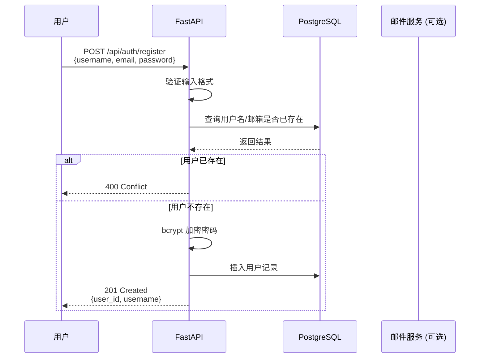
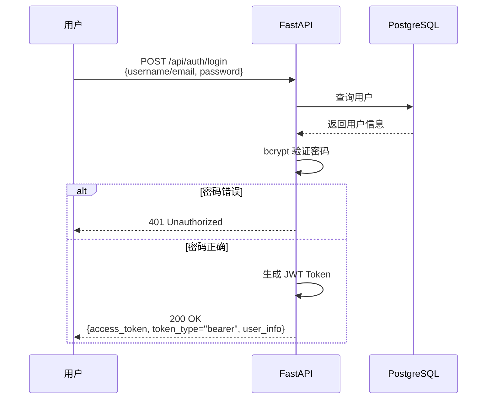
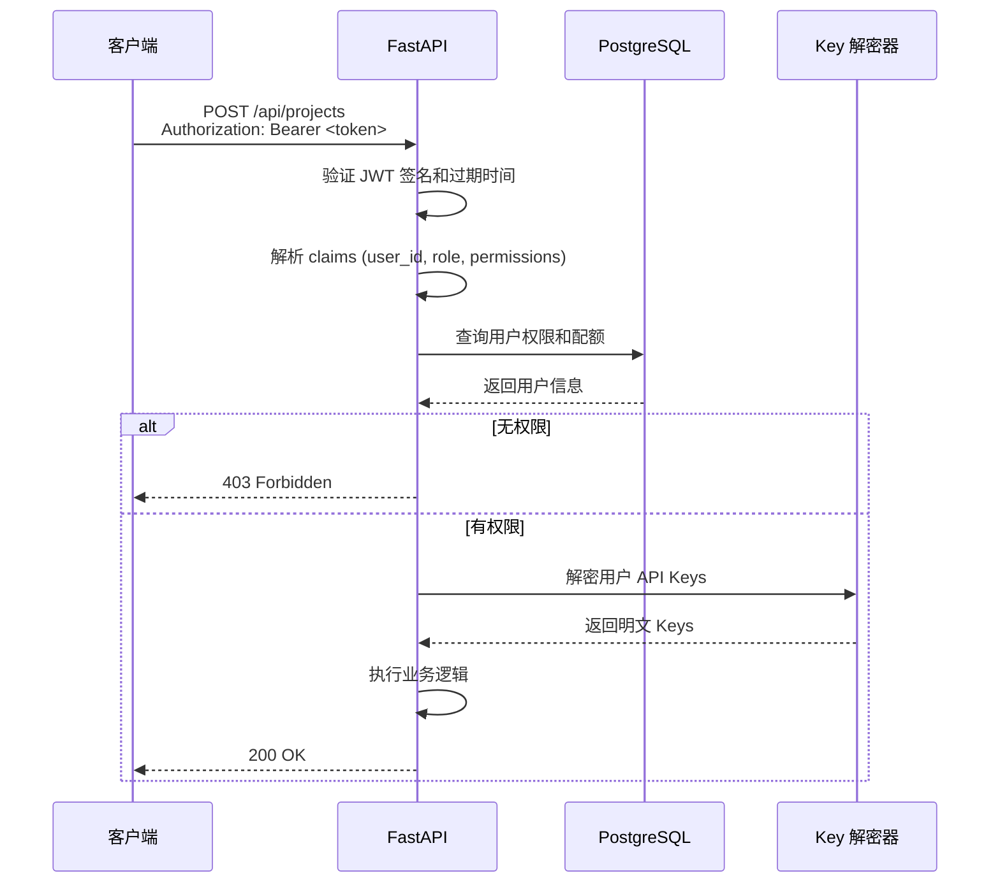

# Pilipili-AutoVideo 用户认证管理升级方案

## 一、现状分析

### 1.1 当前状态

#### 无认证系统的缺点
1. **安全性风险**: API Key 明文存储在配置文件中，任何能访问服务器的人都可以获取
2. **无用户隔离**: 所有用户共享同一配置，无法区分不同用户的资源和项目
3. **无权限管理**: 无法控制不同用户对不同功能的访问权限
4. **无审计日志**: 无法追踪谁在什么时候做了什么操作
5. **无配额管理**: 无法控制每个用户的 API 调用次数和资源使用量

#### 当前配置管理方式
```yaml
# configs/config.yaml (明文存储)
llm:
  deepseek:
    api_key: "sk-xxxxx"  # 明文存储，不安全

video_gen:
  kling:
    api_key: "xxxxx"     # 明文存储
    api_secret: "xxxxx"  # 明文存储
```

#### 当前项目存储方式
```python
# 所有用户项目混在一起
data/outputs/
  ├── project_abc123/
  ├── project_def456/
  └── project_ghi789/  # 无法区分是哪个用户的
```

---

## 二、升级目标

### 2.1 核心目标

1. **用户认证**: 支持用户注册、登录、登出
2. **API Key 加密**: 用户 API Key 加密存储，只有用户本人可解密
3. **资源隔离**: 不同用户的资源和项目完全隔离
4. **权限管理**: 基于角色的访问控制 (RBAC)
5. **审计日志**: 记录所有关键操作
6. **配额管理**: 控制每个用户的资源使用量

### 2.2 非功能目标

1. **向后兼容**: 现有配置文件仍然可用（单用户模式）
2. **性能影响最小**: 认证检查不应显著影响系统性能
3. **易于部署**: 使用现有技术栈，不引入复杂依赖
4. **可扩展**: 支持未来添加 OAuth、SSO 等高级功能

---

## 三、技术方案设计

### 3.1 技术选型

#### 数据库升级: SQLite → PostgreSQL/MySQL

**原因**:
- SQLite 不支持并发写入（单用户场景足够，多用户场景不足）
- 需要更强大的查询能力（用户、项目、配额、日志）
- 支持事务和外键约束

**推荐**:
- **PostgreSQL 15+**: 功能强大，性能优秀
- 或 **MySQL 8.0+**: 兼容性好，部署简单

#### 认证方案: JWT (JSON Web Token)

**选择 JWT 的原因**:
- 无状态，适合 FastAPI
- 支持自定义 claims（用户 ID、角色、权限）
- 成熟生态，FastAPI 原生支持

#### 密码加密: bcrypt

**选择 bcrypt 的原因**:
- 自动加盐，无需额外处理
- 计算成本可调（防止暴力破解）
- Python `passlib` 库原生支持

#### API Key 加密: Fernet (AES-128)

**选择 Fernet 的原因**:
- Python `cryptography` 库内置
- 对称加密，性能好
- 自动处理 IV 和认证

---

### 3.2 数据库设计

#### 表结构设计

```sql
-- 用户表
CREATE TABLE users (
    id SERIAL PRIMARY KEY,
    username VARCHAR(50) UNIQUE NOT NULL,
    email VARCHAR(100) UNIQUE NOT NULL,
    password_hash VARCHAR(255) NOT NULL,
    role VARCHAR(20) DEFAULT 'user',  -- 'admin', 'user', 'viewer'
    is_active BOOLEAN DEFAULT TRUE,
    created_at TIMESTAMP DEFAULT CURRENT_TIMESTAMP,
    updated_at TIMESTAMP DEFAULT CURRENT_TIMESTAMP
);

-- API Keys 表（加密存储）
CREATE TABLE api_keys (
    id SERIAL PRIMARY KEY,
    user_id INTEGER REFERENCES users(id) ON DELETE CASCADE,
    service VARCHAR(50) NOT NULL,  -- 'llm', 'image_gen', 'tts', 'kling', 'seedance'
    key_name VARCHAR(100),
    encrypted_key TEXT NOT NULL,  -- Fernet 加密
    key_salt VARCHAR(255),  -- 用户特定盐
    is_default BOOLEAN DEFAULT FALSE,  -- 是否为该服务的默认 Key
    created_at TIMESTAMP DEFAULT CURRENT_TIMESTAMP,
    updated_at TIMESTAMP DEFAULT CURRENT_TIMESTAMP,
    UNIQUE(user_id, service, key_name)
);

-- 项目表
CREATE TABLE projects (
    id SERIAL PRIMARY KEY,
    user_id INTEGER REFERENCES users(id) ON DELETE CASCADE,
    project_id VARCHAR(50) UNIQUE NOT NULL,  -- UUID 前 8 位
    topic VARCHAR(500) NOT NULL,
    status VARCHAR(50) DEFAULT 'idle',
    result_path TEXT,
    created_at TIMESTAMP DEFAULT CURRENT_TIMESTAMP,
    updated_at TIMESTAMP DEFAULT CURRENT_TIMESTAMP
);

-- 配额表
CREATE TABLE quotas (
    id SERIAL PRIMARY KEY,
    user_id INTEGER REFERENCES users(id) ON DELETE CASCADE,
    service VARCHAR(50) NOT NULL,
    quota_type VARCHAR(50) NOT NULL,  -- 'api_calls', 'storage', 'video_minutes'
    limit_value INTEGER NOT NULL,
    used_value INTEGER DEFAULT 0,
    period VARCHAR(20) DEFAULT 'month',  -- 'day', 'week', 'month', 'year'
    reset_at TIMESTAMP,
    created_at TIMESTAMP DEFAULT CURRENT_TIMESTAMP,
    UNIQUE(user_id, service, quota_type, period)
);

-- 审计日志表
CREATE TABLE audit_logs (
    id SERIAL PRIMARY KEY,
    user_id INTEGER REFERENCES users(id) ON DELETE SET NULL,
    action VARCHAR(100) NOT NULL,  -- 'login', 'create_project', 'update_api_key'
    resource_type VARCHAR(50),  -- 'project', 'api_key', 'user'
    resource_id VARCHAR(100),
    ip_address INET,
    user_agent TEXT,
    details JSONB,
    created_at TIMESTAMP DEFAULT CURRENT_TIMESTAMP
);

-- 索引优化
CREATE INDEX idx_projects_user_id ON projects(user_id);
CREATE INDEX idx_projects_created_at ON projects(created_at);
CREATE INDEX idx_api_keys_user_id ON api_keys(user_id);
CREATE INDEX idx_audit_logs_user_id ON audit_logs(user_id);
CREATE INDEX idx_audit_logs_created_at ON audit_logs(created_at);
```

---

### 3.3 认证流程设计

#### 3.3.1 用户注册流程



#### 3.3.2 用户登录流程



#### 3.3.3 API 请求认证流程



---

### 3.4 核心代码实现

#### 3.4.1 数据库模型 (SQLAlchemy)

```python
# modules/auth/models.py
from sqlalchemy import Column, Integer, String, Boolean, DateTime, ForeignKey, Text, JSON
from sqlalchemy.ext.declarative import declarative_base
from sqlalchemy.orm import relationship
from datetime import datetime

Base = declarative_base()

class User(Base):
    __tablename__ = "users"

    id = Column(Integer, primary_key=True, index=True)
    username = Column(String(50), unique=True, index=True, nullable=False)
    email = Column(String(100), unique=True, index=True, nullable=False)
    password_hash = Column(String(255), nullable=False)
    role = Column(String(20), default="user")  # admin, user, viewer
    is_active = Column(Boolean, default=True)
    created_at = Column(DateTime, default=datetime.utcnow)
    updated_at = Column(DateTime, default=datetime.utcnow, onupdate=datetime.utcnow)

    # 关系
    api_keys = relationship("APIKey", back_populates="user", cascade="all, delete-orphan")
    projects = relationship("Project", back_populates="user", cascade="all, delete-orphan")
    quotas = relationship("Quota", back_populates="user", cascade="all, delete-orphan")
    audit_logs = relationship("AuditLog", back_populates="user", cascade="all, delete-orphan")

class APIKey(Base):
    __tablename__ = "api_keys"

    id = Column(Integer, primary_key=True, index=True)
    user_id = Column(Integer, ForeignKey("users.id", ondelete="CASCADE"), nullable=False)
    service = Column(String(50), nullable=False)
    key_name = Column(String(100))
    encrypted_key = Column(Text, nullable=False)
    key_salt = Column(String(255))
    is_default = Column(Boolean, default=False)
    created_at = Column(DateTime, default=datetime.utcnow)
    updated_at = Column(DateTime, default=datetime.utcnow, onupdate=datetime.utcnow)

    user = relationship("User", back_populates="api_keys")

class Project(Base):
    __tablename__ = "projects"

    id = Column(Integer, primary_key=True, index=True)
    user_id = Column(Integer, ForeignKey("users.id", ondelete="CASCADE"), nullable=False)
    project_id = Column(String(50), unique=True, nullable=False)
    topic = Column(String(500), nullable=False)
    status = Column(String(50), default="idle")
    result_path = Column(Text)
    created_at = Column(DateTime, default=datetime.utcnow)
    updated_at = Column(DateTime, default=datetime.utcnow, onupdate=datetime.utcnow)

    user = relationship("User", back_populates="projects")

class Quota(Base):
    __tablename__ = "quotas"

    id = Column(Integer, primary_key=True, index=True)
    user_id = Column(Integer, ForeignKey("users.id", ondelete="CASCADE"), nullable=False)
    service = Column(String(50), nullable=False)
    quota_type = Column(String(50), nullable=False)
    limit_value = Column(Integer, nullable=False)
    used_value = Column(Integer, default=0)
    period = Column(String(20), default="month")
    reset_at = Column(DateTime)
    created_at = Column(DateTime, default=datetime.utcnow)

    user = relationship("User", back_populates="quotas")

class AuditLog(Base):
    __tablename__ = "audit_logs"

    id = Column(Integer, primary_key=True, index=True)
    user_id = Column(Integer, ForeignKey("users.id", ondelete="SET NULL"), nullable=True)
    action = Column(String(100), nullable=False)
    resource_type = Column(String(50))
    resource_id = Column(String(100))
    ip_address = Column(String(50))
    user_agent = Column(Text)
    details = Column(JSON)
    created_at = Column(DateTime, default=datetime.utcnow)

    user = relationship("User", back_populates="audit_logs")
```

#### 3.4.2 认证依赖项

```python
# modules/auth/security.py
from datetime import datetime, timedelta
from typing import Optional
from jose import JWTError, jwt
from passlib.context import CryptContext
from fastapi import Depends, HTTPException, status
from fastapi.security import OAuth2PasswordBearer
from cryptography.fernet import Fernet
import os

from modules.auth.models import User
from core.config import get_config

# 配置
SECRET_KEY = os.getenv("JWT_SECRET_KEY", "your-secret-key-change-this")
ALGORITHM = "HS256"
ACCESS_TOKEN_EXPIRE_MINUTES = 60 * 24 * 7  # 7 天

# 密码加密
pwd_context = CryptContext(schemes=["bcrypt"], deprecated="auto")

# OAuth2 令牌
oauth2_scheme = OAuth2PasswordBearer(tokenUrl="/api/auth/login")

# API Key 加密 (基于用户密码派生密钥)
def _get_fernet_key(user_password: str, user_salt: str) -> bytes:
    """基于用户密码派生 Fernet 密钥"""
    from hashlib import sha256
    key_material = f"{user_password}:{user_salt}".encode()
    return sha256(key_material).digest()[:32]  # Fernet 需要的 32 字节密钥

def encrypt_api_key(api_key: str, user_password: str, user_salt: str) -> str:
    """加密 API Key"""
    key = _get_fernet_key(user_password, user_salt)
    fernet = Fernet(key)
    encrypted = fernet.encrypt(api_key.encode())
    return encrypted.decode()

def decrypt_api_key(encrypted_key: str, user_password: str, user_salt: str) -> str:
    """解密 API Key"""
    key = _get_fernet_key(user_password, user_salt)
    fernet = Fernet(key)
    decrypted = fernet.decrypt(encrypted_key.encode())
    return decrypted.decode()

# JWT 操作
def create_access_token(data: dict, expires_delta: Optional[timedelta] = None) -> str:
    """创建 JWT Access Token"""
    to_encode = data.copy()
    if expires_delta:
        expire = datetime.utcnow() + expires_delta
    else:
        expire = datetime.utcnow() + timedelta(minutes=ACCESS_TOKEN_EXPIRE_MINUTES)

    to_encode.update({"exp": expire})
    encoded_jwt = jwt.encode(to_encode, SECRET_KEY, algorithm=ALGORITHM)
    return encoded_jwt

def verify_token(token: str) -> Optional[dict]:
    """验证 JWT Token"""
    try:
        payload = jwt.decode(token, SECRET_KEY, algorithms=[ALGORITHM])
        return payload
    except JWTError:
        return None

# 密码操作
def hash_password(password: str) -> str:
    """哈希密码"""
    return pwd_context.hash(password)

def verify_password(plain_password: str, hashed_password: str) -> bool:
    """验证密码"""
    return pwd_context.verify(plain_password, hashed_password)

# FastAPI 依赖项
async def get_current_user(token: str = Depends(oauth2_scheme)) -> User:
    """获取当前用户（依赖项）"""
    credentials_exception = HTTPException(
        status_code=status.HTTP_401_UNAUTHORIZED,
        detail="无效的认证凭据",
        headers={"WWW-Authenticate": "Bearer"},
    )

    payload = verify_token(token)
    if payload is None:
        raise credentials_exception

    user_id = payload.get("sub")
    if user_id is None:
        raise credentials_exception

    # 从数据库查询用户
    from modules.auth.database import get_db
    db = next(get_db())
    user = db.query(User).filter(User.id == user_id).first()

    if user is None:
        raise credentials_exception

    if not user.is_active:
        raise HTTPException(status_code=403, detail="用户已被禁用")

    return user

async def get_current_active_user(current_user: User = Depends(get_current_user)) -> User:
    """获取当前活跃用户"""
    if not current_user.is_active:
        raise HTTPException(status_code=400, detail="用户未激活")
    return current_user

# 权限检查
def require_role(*roles: str):
    """要求特定角色的装饰器工厂"""
    async def role_checker(current_user: User = Depends(get_current_active_user)) -> User:
        if current_user.role not in roles:
            raise HTTPException(status_code=403, detail="权限不足")
        return current_user
    return role_checker
```

#### 3.4.3 认证 API 端点

```python
# modules/auth/routes.py
from fastapi import APIRouter, Depends, HTTPException, status
from pydantic import BaseModel, EmailStr
from typing import Optional

from modules.auth.models import User, APIKey, AuditLog
from modules.auth.security import (
    hash_password, verify_password, create_access_token,
    encrypt_api_key, decrypt_api_key, get_current_active_user
)
from modules.auth.database import get_db

router = APIRouter(prefix="/api/auth", tags=["认证"])

# 请求/响应模型
class UserRegister(BaseModel):
    username: str
    email: EmailStr
    password: str

class UserLogin(BaseModel):
    username_email: str  # 用户名或邮箱
    password: str

class TokenResponse(BaseModel):
    access_token: str
    token_type: str = "bearer"
    user_id: int
    username: str
    role: str

class APIKeyCreate(BaseModel):
    service: str
    key_name: str
    api_key: str

# 端点
@router.post("/register", response_model=TokenResponse)
async def register(user_data: UserRegister):
    """用户注册"""
    db = next(get_db())

    # 检查用户名/邮箱是否已存在
    existing_user = db.query(User).filter(
        (User.username == user_data.username) | (User.email == user_data.email)
    ).first()

    if existing_user:
        raise HTTPException(
            status_code=400,
            detail="用户名或邮箱已被使用"
        )

    # 创建用户
    user = User(
        username=user_data.username,
        email=user_data.email,
        password_hash=hash_password(user_data.password),
        role="user"
    )
    db.add(user)
    db.commit()
    db.refresh(user)

    # 生成 Token
    access_token = create_access_token(data={"sub": user.id})

    # 记录审计日志
    audit_log = AuditLog(
        user_id=user.id,
        action="register",
        resource_type="user",
        resource_id=str(user.id)
    )
    db.add(audit_log)
    db.commit()

    return TokenResponse(
        access_token=access_token,
        user_id=user.id,
        username=user.username,
        role=user.role
    )

@router.post("/login", response_model=TokenResponse)
async def login(login_data: UserLogin):
    """用户登录"""
    db = next(get_db())

    # 查询用户（用户名或邮箱）
    user = db.query(User).filter(
        (User.username == login_data.username_email) |
        (User.email == login_data.username_email)
    ).first()

    if not user or not verify_password(login_data.password, user.password_hash):
        raise HTTPException(
            status_code=401,
            detail="用户名或密码错误"
        )

    # 生成 Token
    access_token = create_access_token(data={"sub": user.id})

    # 记录审计日志
    audit_log = AuditLog(
        user_id=user.id,
        action="login",
        resource_type="user",
        resource_id=str(user.id)
    )
    db.add(audit_log)
    db.commit()

    return TokenResponse(
        access_token=access_token,
        user_id=user.id,
        username=user.username,
        role=user.role
    )

@router.post("/api-keys")
async def create_api_key(
    key_data: APIKeyCreate,
    current_user: User = Depends(get_current_active_user)
):
    """创建/更新 API Key（加密存储）"""
    db = next(get_db())

    # 生成盐
    import secrets
    user_salt = secrets.token_hex(16)

    # 加密 API Key
    encrypted_key = encrypt_api_key(
        key_data.api_key,
        current_user.password_hash,  # 使用密码哈希作为密钥派生基础
        user_salt
    )

    # 查找现有 Key
    existing_key = db.query(APIKey).filter(
        APIKey.user_id == current_user.id,
        APIKey.service == key_data.service,
        APIKey.key_name == key_data.key_name
    ).first()

    if existing_key:
        # 更新
        existing_key.encrypted_key = encrypted_key
        existing_key.key_salt = user_salt
        existing_key.updated_at = datetime.utcnow()
    else:
        # 创建
        api_key = APIKey(
            user_id=current_user.id,
            service=key_data.service,
            key_name=key_data.key_name,
            encrypted_key=encrypted_key,
            key_salt=user_salt,
            is_default=True
        )
        db.add(api_key)

    db.commit()

    # 记录审计日志
    audit_log = AuditLog(
        user_id=current_user.id,
        action="update_api_key",
        resource_type="api_key",
        resource_id=f"{key_data.service}:{key_data.key_name}"
    )
    db.add(audit_log)
    db.commit()

    return {"message": "API Key 已保存"}

@router.get("/api-keys")
async def list_api_keys(current_user: User = Depends(get_current_active_user)):
    """列出当前用户的 API Keys（不返回明文）"""
    db = next(get_db())

    api_keys = db.query(APIKey).filter(
        APIKey.user_id == current_user.id
    ).all()

    return [
        {
            "service": key.service,
            "key_name": key.key_name,
            "is_default": key.is_default,
            "created_at": key.created_at
        }
        for key in api_keys
    ]
```

#### 3.4.4 配置系统改造

```python
# modules/auth/config_loader.py
from typing import Dict, Optional
from modules.auth.models import User, APIKey
from modules.auth.security import decrypt_api_key
from modules.auth.database import get_db

def load_user_api_keys(user: User) -> Dict[str, str]:
    """加载用户的 API Keys（解密）"""
    db = next(get_db())

    api_keys = db.query(APIKey).filter(
        APIKey.user_id == user.id,
        APIKey.is_default == True
    ).all()

    keys = {}
    for key in api_keys:
        # 解密
        plain_key = decrypt_api_key(
            key.encrypted_key,
            user.password_hash,
            key.key_salt
        )
        keys[key.service] = plain_key

    return keys

# 修改现有工作流，使用用户专属 API Keys
async def run_workflow_with_auth(project_id: str, request: CreateProjectRequest, current_user: User):
    """带认证的工作流执行"""

    # 加载用户的 API Keys
    user_keys = load_user_api_keys(current_user)

    # 检查配额
    from modules.auth.quota import check_quota
    if not check_quota(current_user.id, "video_gen", "api_calls", 1):
        raise HTTPException(403, "配额不足，请升级套餐")

    # 执行工作流（使用用户专属 Keys）
    config = get_config()
    config.llm.deepseek.api_key = user_keys.get("llm_deepseek")
    config.image_gen.api_key = user_keys.get("image_gen")
    config.tts.api_key = user_keys.get("tts")
    config.video_gen.kling.api_key = user_keys.get("kling")

    # ... 其余工作流逻辑不变 ...
```

---

### 3.5 配额管理系统

```python
# modules/auth/quota.py
from datetime import datetime, timedelta
from sqlalchemy import func
from modules.auth.models import Quota, AuditLog
from modules.auth.database import get_db

def check_quota(user_id: int, service: str, quota_type: str, increment: int = 1) -> bool:
    """检查并更新配额"""
    db = next(get_db())

    # 查询配额
    quota = db.query(Quota).filter(
        Quota.user_id == user_id,
        Quota.service == service,
        Quota.quota_type == quota_type
    ).first()

    if not quota:
        return True  # 无配额限制

    # 检查是否需要重置
    if quota.reset_at and datetime.utcnow() >= quota.reset_at:
        quota.used_value = 0
        if quota.period == "day":
            quota.reset_at = datetime.utcnow() + timedelta(days=1)
        elif quota.period == "week":
            quota.reset_at = datetime.utcnow() + timedelta(weeks=1)
        elif quota.period == "month":
            quota.reset_at = datetime.utcnow() + timedelta(days=30)

    # 检查是否超限
    if quota.used_value + increment > quota.limit_value:
        return False

    # 更新已用量
    quota.used_value += increment
    db.commit()

    return True

def set_quota(user_id: int, service: str, quota_type: str, limit: int, period: str = "month"):
    """设置用户配额"""
    db = next(get_db())

    quota = db.query(Quota).filter(
        Quota.user_id == user_id,
        Quota.service == service,
        Quota.quota_type == quota_type
    ).first()

    if quota:
        quota.limit_value = limit
        quota.period = period
    else:
        quota = Quota(
            user_id=user_id,
            service=service,
            quota_type=quota_type,
            limit_value=limit,
            period=period,
            used_value=0,
            reset_at=datetime.utcnow() + timedelta(days=30)
        )
        db.add(quota)

    db.commit()
```

---

## 四、实施计划

### 4.1 阶段划分

#### 阶段 1: 数据库迁移 (1-2 周)

**任务**:
1. 搭建 PostgreSQL 环境
2. 创建数据库和表结构
3. 编写数据库迁移脚本
4. 数据备份和恢复测试

**交付物**:
- `migrations/001_init_db.py`: 初始化数据库脚本
- `docker-compose.db.yml`: PostgreSQL 部署配置

---

#### 阶段 2: 认证系统开发 (2-3 周)

**任务**:
1. 实现用户注册/登录/登出
2. 实现 JWT Token 生成和验证
3. 实现 API Key 加密/解密
4. 实现权限检查中间件

**交付物**:
- `modules/auth/models.py`: 数据库模型
- `modules/auth/security.py`: 安全工具函数
- `modules/auth/routes.py`: 认证 API 端点
- `modules/auth/database.py`: 数据库会话管理

---

#### 阶段 3: 集成到现有系统 (2 周)

**任务**:
1. 修改所有 API 端点，添加认证依赖
2. 修改项目存储逻辑，按用户隔离
3. 修改配置加载逻辑，使用用户专属 Keys
4. 添加审计日志记录

**交付物**:
- 更新后的 `api/server.py`
- 更新后的 `core/config.py`
- 迁移脚本 `migrations/002_migrate_projects.py`

---

#### 阶段 4: 配额和审计 (1 周)

**任务**:
1. 实现配额检查逻辑
2. 实现审计日志记录
3. 添加配额超限告警
4. 实现审计日志查询 API

**交付物**:
- `modules/auth/quota.py`: 配额管理
- `modules/auth/audit.py`: 审计日志
- 前端配额显示组件

---

#### 阶段 5: 前端改造 (2 周)

**任务**:
1. 实现登录/注册页面
2. 实现 API Key 管理页面
3. 实现配额查看页面
4. 实现审计日志查看页面

**交付物**:
- `pilipili-frontend/client/pages/Login.tsx`
- `pilipili-frontend/client/pages/Register.tsx`
- `pilipili-frontend/client/pages/Settings.tsx`

---

#### 阶段 6: 测试和部署 (1 周)

**任务**:
1. 单元测试（认证、配额、审计）
2. 集成测试（完整工作流）
3. 性能测试（认证延迟影响）
4. 生产环境部署

**交付物**:
- `tests/test_auth.py`: 认证测试套件
- 部署文档 `docs/AUTH_DEPLOY.md`

---

### 4.2 时间估算

| 阶段 | 工作量 | 依赖 |
|------|--------|------|
| 阶段 1: 数据库迁移 | 1-2 周 | 无 |
| 阶段 2: 认证系统开发 | 2-3 周 | 阶段 1 |
| 阶段 3: 集成到现有系统 | 2 周 | 阶段 2 |
| 阶段 4: 配额和审计 | 1 周 | 阶段 3 |
| 阶段 5: 前端改造 | 2 周 | 阶段 3 |
| 阶段 6: 测试和部署 | 1 周 | 所有阶段 |
| **总计** | **9-11 周** | |

---

## 五、风险和挑战

### 5.1 技术风险

1. **数据库迁移**: 从 SQLite 迁移到 PostgreSQL 可能有兼容性问题
   - **缓解**: 充分测试迁移脚本，准备回滚方案

2. **性能影响**: 认证检查可能增加 API 延迟
   - **缓解**: 使用 Redis 缓存用户信息和 Token

3. **API Key 解密**: 基于用户密码派生密钥，密码修改后无法解密
   - **缓解**: 密码修改时重新加密所有 API Keys

### 5.2 安全风险

1. **JWT Token 泄露**: Token 被盗后无法撤销（除非过期）
   - **缓解**: 使用短有效期 + Refresh Token 机制

2. **SQL 注入**: 如果 ORM 使用不当
   - **缓解**: 严格使用 SQLAlchemy ORM，避免原生 SQL

3. **暴力破解**: 登录接口可能被暴力攻击
   - **缓解**: 添加登录失败限制和验证码

### 5.3 用户体验风险

1. **学习成本**: 用户需要注册和配置 API Keys
   - **缓解**: 提供详细教程和引导流程

2. **配额限制**: 用户可能不满配额限制
   - **缓解**: 提供多种套餐，免费用户也有基础配额

---

## 六、总结

### 6.1 升级后的优势

1. **安全性提升**: API Key 加密存储，用户隔离
2. **多用户支持**: 支持团队协作和多租户部署
3. **可追溯性**: 审计日志记录所有关键操作
4. **成本控制**: 配额管理防止资源滥用
5. **权限管理**: 基于角色的访问控制

### 6.2 向后兼容性

- 保留单用户模式（使用配置文件）
- 新用户强制使用认证系统
- 提供迁移脚本，帮助现有用户迁移数据

### 6.3 后续扩展

1. **OAuth 2.0 集成**: 支持 Google、GitHub 第三方登录
2. **SSO 单点登录**: 企业级单点登录
3. **多因素认证 (MFA)**: 提升账户安全性
4. **API 密钥管理**: 类似 OpenRouter 的 API Key 轮换机制
